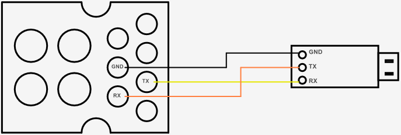

# A Python Script to Read the SX3 Battery Registers 

This Python script scans for available serial ports, prompts the user to select a port, and then reads the Modbus registers from the VM battery, which is connected via a USB to UART bridge. The script transforms and renames the Modbus register values, and then displays the results.

**Note: The Battery Management System (BMS) must be operational to read its memory. If the battery is completely drained, this script will not work.**


## Features

- Scans for available serial ports.
- Prompts the user to select a serial port.
- Reads Modbus holding registers from the battery.
- Transforms and renames the register values.
- Displays the transformed data. 


## Requirements
Hardware:
- 1x USB to UART Bridge (CP2102)
- 3x Female to male jumper wires
- 1x Male to male jumper wire

Software:
- Python 3.6 or higher
- Python virtualenv (optional)
- Git (optional)
- [PySerial](https://github.com/pyserial/pyserial)
- [PyModbus](https://github.com/pymodbus-dev/pymodbus)


## Installation

1. **Install Python:**
If you don't have Python installed already, download and install from the official [website](https://www.python.org/downloads/).

2. **Clone the repository:**
    If you have Git installed:
   ```sh
   git clone https://github.com/VangelisBV/vanmoof-battery-tool.git
   # Then enter the directory
   cd vanmoof-battery-tool

If you don't have git installed:
- Click on the "Code" button and download the repository as a zip file, then unzip it
- Open a terminal window and enter the directory, for example on Windows:
    ```sh
    cd C:\Users\YourUser\Downloads\vanmoof-battery-tool-main #Assuming you extracted the file in the Downloads directory

3. **Create a virtual environment (optional but recommended):**
    ```sh
    pip install virtualenv   
    python -m virtualenv venv
    venv\Scripts\activate #On Linux, use: source venv/bin/activate 

4. **Install the required libraries:**
    ```sh
    pip install -r requirements.txt


## Usage

1. **Connect the battery to your PC using a USB to UART bridge according to the diagram (start from the battery side):**



2. **Run the script:**
    ```sh
    python main.py

3. **Follow the prompts to select the serial port:**
- The script will list all available serial ports.
- Enter the index number corresponding to the port your battery is connected to.

4. **"Wake up" the battery:**
The script will ask you to momentarily bridge (connect and disconnect) the DET and the TEST pins of the battery 
(Note: This will "activate" the battery for 10sec, meaning the discharge pins will have voltage for 10sec)


5. **Read the results:**
The registers values are transformed, renamed and then the results are displayed.


## Example Output
    ```sh
    \\          //
     \\        //
      \\      //
       \\    //
        \\  //
         \\//
    VB Tool v1.0.0

    Available serial ports:
    0: COM9 - Silicon Labs CP210x USB to UART Bridge (COM9)

    Enter the index number of the port you want to connect to: 0
    Connected to COM9.

    Bridge the DET and TEST pins


    I am G5 VanMoof BL V004 2019-11-19

    ResetStatus=0x0C000002

    Errors: No errors
    Voltage: 40.345 Volt
    SOC: 90 %
    ESN: D3A02224C001H2
    Nominal Capacity: 12600 mAh
    Full Charge Capacity: 12494 mAh
    Remaining Capacity: 11209 mAh
    Cycles: 96
    Cells Pack 1: 4.036 V
    Cells Pack 2: 4.035 V
    Cells Pack 3: 4.035 V
    Cells Pack 4: 4.034 V
    Cells Pack 5: 4.034 V
    Cells Pack 6: 4.035 V
    Cells Pack 7: 4.032 V
    Cells Pack 8: 4.035 V
    Cells Pack 9: 4.034 V
    Cells Pack 10: 4.035 V
    Cell Packs Max Actual: 4.036 V
    Cell Packs Min Actual: 4.032 V


## Contributing & Future Plans
Research to expand the tool is ongoing and contributions are welcome! Please feel free to submit a Pull Request or open an Issue if you have suggestions for improvements, bug reports, or new features.


## Acknowledgments
- [PySerial](https://github.com/pyserial/pyserial)
- [PyModbus](https://github.com/pymodbus-dev/pymodbus)


## Disclaimer
This software is provided "as is". The authors make no representations or warranties of any kind concerning the safety, suitability, inaccuracies or other harmful components of this software. The authors will not be liable for any damages you may suffer in connection with using, modifying, or distributing this software.

**Use this software at your own risk.** This project is intended for research purposes only. 

**Please note that registers naming and transformations have been done based on my own research and no information has been provided by VM.**